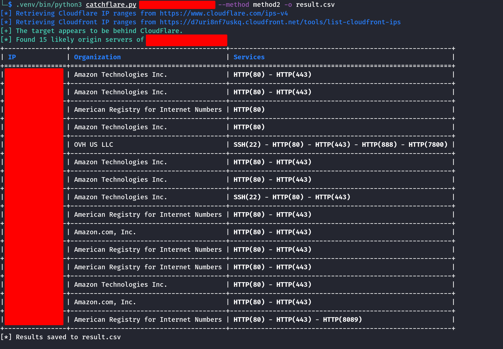
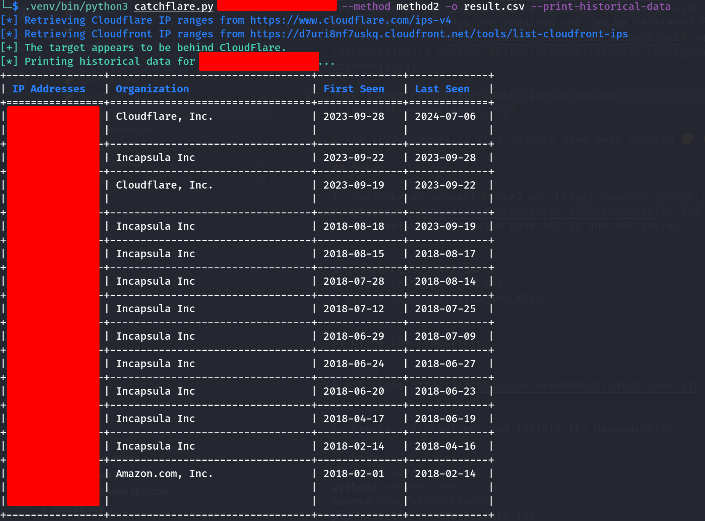

# CatchFlare

CatchFlare is a tool to find origin servers of websites protected by CloudFlare (or CloudFront) which are publicly exposed and don't appropriately restrict network access to the relevant CDN IP ranges.

The tool uses Internet-wide scan data from [Censys](https://censys.io) and [SecurityTrails](https://securitytrails.com) to find exposed IPv4 hosts presenting an SSL certificate associated with the target's domain name. API keys are required and can be retrieved from your [Censys account](https://search.censys.io/account/api) and [SecurityTrails account](https://securitytrails.com/app/account/credentials).

Here's what CatchFlare looks like in action.

print the historical data of a website


(_The IP addresses in this example have been blurred 🤫_)

## Setup

1. Register an account (free) on <https://search.censys.io/register>
2. Browse to <https://search.censys.io/account/api>, and set two environment variables with your API ID and API secret

```bash
$ export CENSYS_API_ID=...
$ export CENSYS_API_SECRET=...
$ export SECURITYTRAILS_API_KEY=...
```

3. Clone the repository

```bash
$ git clone https://github.com/Ay0ubN0uri/CatchFlare.git
```

4. Create a virtual env and install the dependencies

```bash
cd CatchFlare
python3 -m venv venv
source venv/bin/activate
pip install -r requirements.txt
```

5. Run CatchFlare (see [Usage](#usage) below for more detail)

```bash
python catchflare.py myvulnerable.site
```

or for CloudFront

```bash
python catchflare.py myvulnerable.site --cloudfront
```

## Usage

```bash
$ python catchflare.py --help

usage: catchflare.py [-h] [-o OUTPUT_FILE] [--censys-api-id CENSYS_API_ID] [--censys-api-secret CENSYS_API_SECRET] [--print-historical-data]
                     [--securitytrails-api-key SECURITYTRAILS_API_KEY] [--method {method1,method2}] [--cloudfront]
                     domain

positional arguments:
  domain                The target domain to scan

options:
  -h, --help            show this help message and exit
  -o OUTPUT_FILE, --output OUTPUT_FILE
                        A csv file to output the results (default: None)
  --censys-api-id CENSYS_API_ID
                        Censys API ID. Can also be defined using the CENSYS_API_ID environment variable (default: None)
  --censys-api-secret CENSYS_API_SECRET
                        Censys API secret. Can also be defined using the CENSYS_API_SECRET environment variable (default: None)
  --print-historical-data
                        Print historical data for the domain. (default: False)
  --securitytrails-api-key SECURITYTRAILS_API_KEY
                        SecurityTrails API key. Can also be defined using the SECURITYTRAILS_API_KEY environment variable (default: None)
  --method {method1,method2}
                        Specify the method to use (method1 or method2) (default: method1)
  --cloudfront          Check Cloudfront instead of CloudFlare. (default: False)
```
